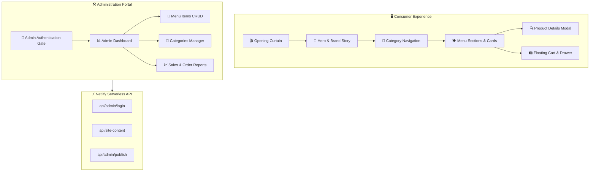

<div align="center">

# ☕ Baleno Cinematic Digital Menu
### Luxury Digital Dining Experience & Interactive Café Menu Platform

[](https://react.dev/)
[](https://www.typescriptlang.org/)
[](https://vitejs.dev/)
[](https://tailwindcss.com/)
[](https://ui.shadcn.com/)
[](LICENSE)
[](https://github.com/OmarAlfar0uk)

<p align="center">
  <a href="#-key-features">Key Features</a> •
  <a href="#-system-architecture">System Architecture</a> •
  <a href="#-tech-stack">Tech Stack</a> •
  <a href="#-getting-started">Getting Started</a> •
  <a href="#-author">Author</a>
</p>

</div>

---

## 📌 Executive Overview

**Baleno Cinematic Digital Menu** is an ultra-premium, interactive digital menu and order management experience created for high-end cafés, bistros, and restaurants. Featuring smooth cinematic transitions, dynamic category filtering, interactive product modals, and an integrated **Admin Portal** for real-time inventory and pricing management, it transforms physical dining into an immersive digital journey.

> [!NOTE]
> Built with **React 18**, **TypeScript**, **Tailwind CSS**, and **shadcn/ui** components, optimized with **Vite** for sub-second page loads and seamless mobile responsiveness.

---

## ✨ Key Features

| ⚡ Feature | 💡 Description | 🛠 Engineering & UX Detail |
|---|---|---|
| **🎬 Cinematic Curtain Opening** | Elegant grand opening animation when launching the menu | Smooth CSS transitions and stateful intro sequence |
| **🛍️ Floating Cart & Drawer** | Persistent order drawer with item counter and real-time total | Slide-over drawer with instant recalculations |
| **🔍 Interactive Product Modal** | Detailed item descriptions, ingredients, allergens, and photos | Accessible Radix UI Dialog with smooth backdrop blur |
| **⚙️ Admin Dashboard** | Full backoffice management for categories, menu items, and prices | Secure admin gate with CRUD controls and reports |
| **📱 Mobile-First Responsive** | Optimized touch targets, smooth swipe navigation, and dark mode | Tailwind CSS utility-first responsive layout |
| **🧪 End-to-End Testing** | Automated UI verification with Playwright | Robust test coverage for ordering flows and navigation |

---

## 🏛 System Architecture



---

## ⚡ Tech Stack

| Category | Technology | Purpose |
|---|---|---|
| **Frontend Framework** |   | Component architecture and type-safe UI logic |
| **Build & Tooling** |  | Blazing-fast HMR and bundle optimization |
| **Styling & Components**|   | Modern aesthetic design tokens and accessible primitives |
| **Testing** |   | End-to-end user journey and component testing |
| **Serverless API** |  | Lightweight serverless endpoints for administrative actions |

---

## 🚀 Getting Started

### Prerequisites
- [Node.js 18+](https://nodejs.org/) or [Bun](https://bun.sh/)

### Installation & Development

1. **Clone the repository:**
   ```bash
   git clone https://github.com/OmarAlfar0uk/baleno-cinematic-menu-main.git
   cd baleno-cinematic-menu-main
   ```

2. **Install dependencies:**
   ```bash
   npm install
   # or with bun: bun install
   ```

3. **Start Development Server:**
   ```bash
   npm run dev
   ```
   Navigate to `http://localhost:5173` in your browser.

4. **Build for Production:**
   ```bash
   npm run build
   ```

---

## 👨‍💻 Author

**Omar Alfarouk**  
*Full-Stack .NET & Software Engineer*  

- 🌐 **GitHub:** [@OmarAlfar0uk](https://github.com/OmarAlfar0uk)
- 💼 **LinkedIn:** [omar-alfarouk](https://www.linkedin.com/in/omar-alfarouk-252471251/)
- 📧 **Email:** [omaralfarouk646@gmail.com](mailto:omaralfarouk646@gmail.com)

---

<div align="center">
  <sub>Built with ❤️ by Omar Alfarouk. Licensed under the <a href="LICENSE">MIT License</a>.</sub>
</div>
